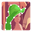
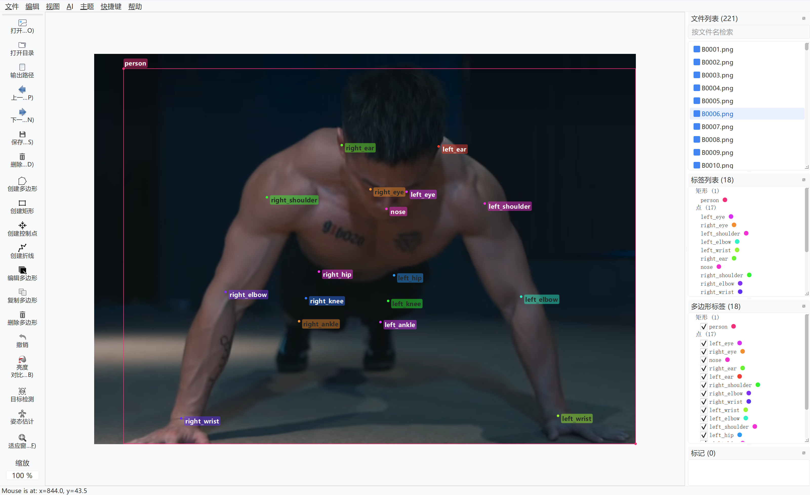
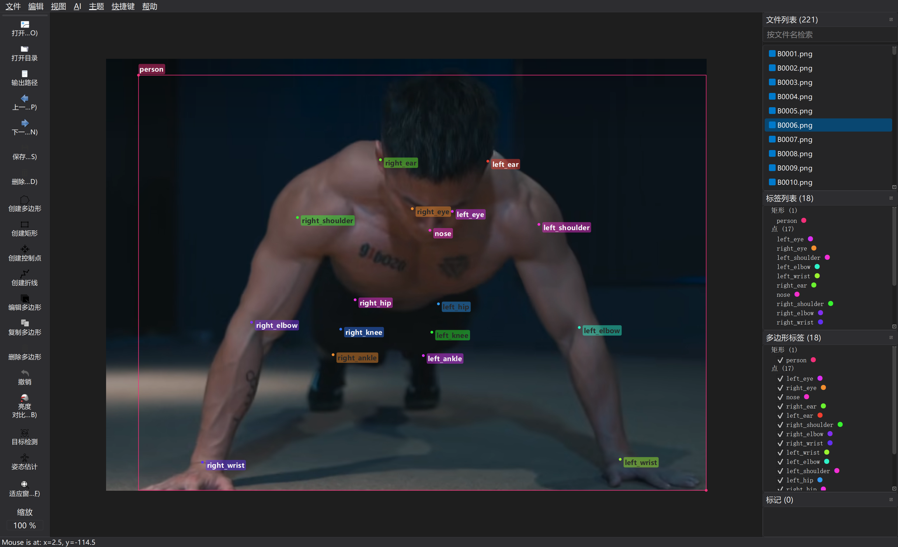

<h1 align="center">
  <br/>labelu
</h1>
<h4 align="center">
  Image Polygonal Annotation with Python
</h4>


<table>
	<tr>
		<td>
			
		</td>
		<td> 
			
		</td>
	</tr>
</table>
### 使用方法

1. clone 项目到本地

    ```bash
    git clone https://github.com/SprInec/labelme.git
    cd labelme
    ```

2. 本地安装

    ```bash
    pip install -e .
    ```

3. 命令行启动

    ```
    python ./labelme/__main__.py
    # or
    labelme
    ```

> [!tip]
>
> 若是报错缺少什么包，请通过 `pip` 自行根据报错信息安装
>
> 半自动化标注功能依赖： `torch` `torchvision` `mmdet` `mmpose` `mmengine` `mmcv`
>
> mmpose 存放位置：`labelme\labelme\_automation\mmpose`

### 功能优化与新增

- 更新了大部分 UI 图标，功能指意更明确
- 设计了明暗两种主题，界面风格现代、简约，美观
- <mark>视图</mark>菜单新增<mark>显示标签名称</mark>选项，开启后可在画面中显示标签名称
- 新增自动保存工作区状态功能
- 优化了标签窗口布局与大小，更改其默认打开位置为屏幕中心
- 添加了标签颜色更改功能
- 新增了<mark>AI</mark>菜单，可在该菜单的设置选项中完成半自动标注AI模型的相关配置
- 工具栏的AI相关工具移动到了<mark>AI</mark>菜单下
- 优化了标签被选中时的强调效果
- 优化了<mark>创建矩形</mark>工具辅助线的颜色
- 新增了<mark>标签列表</mark>和<mark>多边形标签</mark>窗口的类别分类功能
- 新增了<mark>快捷键</mark>菜单，可自定义相关操作快捷键
- 优化了工具栏布局，实现了分离、四周停靠等布局效果
- 在工具栏中新增了一些常用操作
- <mark>自动保存</mark>更改为默认开启
- <mark>同时保存图像数据</mark>更改为默认关闭
- 更改了标签随机颜色生成效果，更改为更鲜艳的颜色便于分辨
- 新增了画面框选功能，可通过鼠标在画面中同时框选中多个标签进行管理
- 优化了<mark>文件列表</mark>项的名称显示，取消了路径信息
- 实现了<mark>文件列表</mark>、<mark>标签列表</mark>、<mark>多边形标签</mark>、<mark>标记</mark>的数量统计功能
- 优化了右侧四个 Dock 栏的 UI
- 支持了更多模型的半自动化标注
- 优化了 labelme 原生的 AI Mask 半自动化标注配置和功能
- 重新设计了标签对话框窗口中标签项的样式
- 增加了标签云流式布局选项
- 新增了未使用标签强调功能
- 新增了标签列表便捷标注功能
- 新增画布中选中标签后可通过空格切换标签显隐状态功能
- 新增画布中双击标签形状快速打开编辑对话框功能
- 显示标签名称功能新增 Group ID 与 Description 内容显示
- 优化了标签对话框弹出位置

### 半自动标注

实现了基于 torch / mmdetection / mmpose / yolo 的半自动化标注

|          目标检测          |        人体姿态估计        |          分割蒙版          |
| :------------------------: | :------------------------: | :------------------------: |
| Faster R-CNN ResNet-50 FPN | KeypointRCNN (Torchvision) | SegmentAnything (accuracy) |
|  Mask R-CNN ResNet-50 FPN  |         RTMO-Tiny          | SegmentAnything (accuracy) |
|  RetinaNet ResNet-50 FPN   |         RTMO-Small         | SegmentAnything (balanced) |
|        RTMDet-Tiny         |        RTMO-Medium         |  SegmentAnything (speed)   |
|        RTMDet-Small        |         RTMO-Large         |  EfficientSam (accuracy)   |
|       RTMDet-Medium        |        RTMPose-Tiny        |    EfficientSam (speed)    |
|        RTMDet-Large        |       RTMPose-Small        |      Sam2 (accuracy)       |
|           YOL0v7           |       RTMPose-Medium       |      Sam2 (balanced)       |
|        YOLOv7-Tiny         |       RTMPose-Large        |        Sam2 (speed)        |
|          YOL0v7x           |         HRNet-W32          |        Sam2 (tiny)         |
|         YOLOv7-W6          |         HRNet-W48          |                            |
|         YOLOv7-E6          |      ~~YOLOv7-Pose~~       |                            |
|         YOLOv7-D6          |                            |                            |
|         YOLOv7-E6E         |                            |                            |

> [!note]
>
> 目标检测支持类别：
>
> `person`, `bicycle`, `car`, `motorcycle`, `airplane`, `bus`, `train`, `truck`,`boat`, `traffic light`, `fire hydrant`, `stop sign`, `parking meter`, `bench`,`bird`, `cat`, `dog`, `horse`, `sheep`, `cow`, `elephant`, `bear`, `zebra`,`giraffe`, `backpack`, `umbrella`, `handbag`, `tie`, `suitcase`, `frisbee`, `skis`, `snowboard`, `sports ball`, `kite`, `baseball bat`, `baseball glove`, `skateboard`, `surfboard`, `tennis racket`, `bottle`, `wine glass`, `cup`, `fork`, `knife`, `spoon`, `bowl`, `banana`, `apple`, `sandwich`, `orange`, `broccoli`, `carrot`, `hot dog`, `pizza`, `donut`, `cake`, `chair`, `couch`,`potted plant`, `bed`, `dining table`, `toilet`, `tv`, `laptop`, `mouse`,`remote`, `keyboard`, `cell phone`, `microwave`, `oven`, `toaster`, `sink`,`refrigerator`, `book`, `clock`, `vase`, `scissors`, `teddy bear`, `hair drier`,`toothbrush`
